# 柔度算子法

提出一种基于柔度算子的动力学建模方法，利用神经网络预测柔性体的柔度张量场，建立外力场与位移场之间的算子映射。该方法省去了有限元计算中最繁琐耗时的网格划分与全局方程求解过程，预测得到的柔度张量可直接嵌入现有的动力学与接触仿真框架中，保持良好的物理一致性与可解释性。在保持精度的前提下，计算效率相比有限元方法有数量级提升。

---

## 案例一：齿轮对接触案例

### 1 模型描述

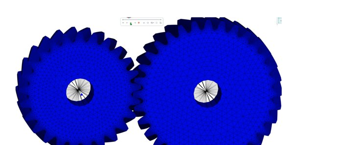

左右两个斜齿轮建立为新模态柔性体，左边小齿轮施加驱动，右边大齿轮施加力矩，使两个齿轮相互啮合转动，持续产生稳定接触。

- **小齿轮**：54910 节点，261609 单元，接触界面自由度 21504
- **大齿轮**：58144 节点，267064 单元，接触界面自由度 17850

### 2 计算结果

**新模态柔性体接触合力**

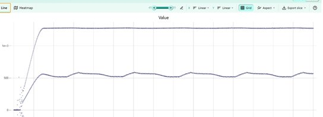

**有限元体接触合力**

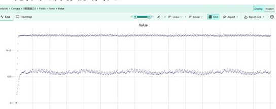

### 3 数据统计

|  | 生成模态数据 | 模型训练 | 仿真总耗时 | 神经网络查询耗时 |
|--|--|--|--|--|
| 新模态（神经网络） | 10651s（含应力数据 14081s） | ~1000s | 290s | 82s |
| 有限元 | — | — | ~10h | — |

---

## 案例二：齿轮齿条接触案例

### 1 模型描述

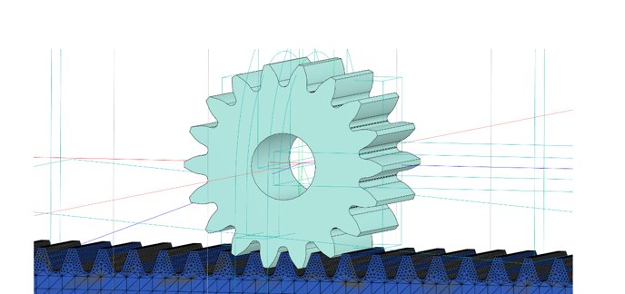

齿条建立为新模态，齿轮为刚体。固定齿条，在齿轮上施加驱动使其沿齿条单向运动。

- **齿条**：49294 节点，240074 单元，接触界面自由度 19995

### 2 计算结果

**新模态柔性体接触合力**

**有限元体接触合力**

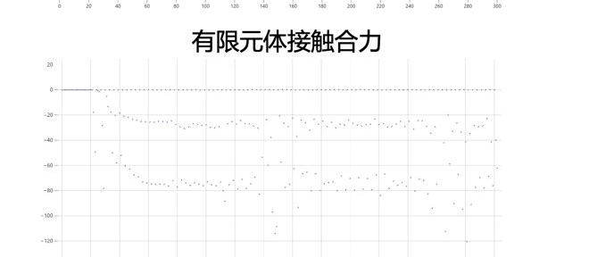

**仿真网格结果**

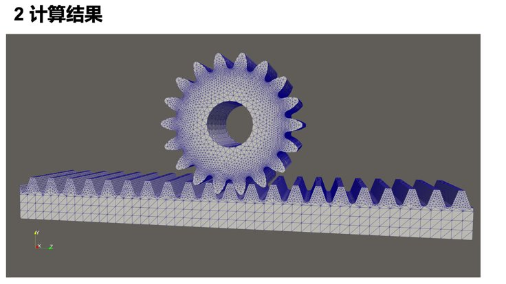

**应力云图**

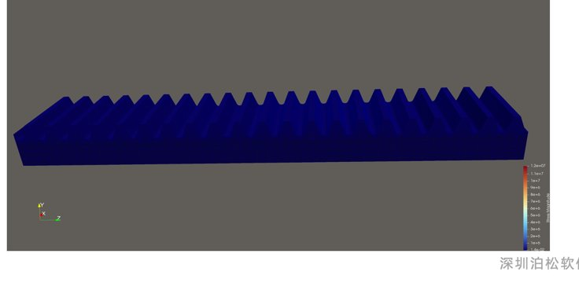

### 3 数据统计

|  | 生成模态数据 | 模型训练 | 仿真总耗时 | 神经网络查询耗时 |
|--|--|--|--|--|
| 新模态（神经网络） | 10651s（含应力数据 14081s） | 数据前处理：437s；训练时长：624s | 3335s | 496s |
| 有限元 | — | — | 9222.684s | — |

---

## 案例三：手机卡槽接触案例

### 1 模型描述

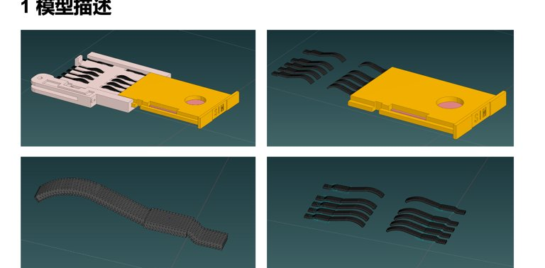

- SIM 卡（刚体）和卡托（刚体）与大地添加移动副，在移动副上添加驱动后 SIM 卡和卡托挤压柔性弹片
- 柔性弹片分别建立为有限元柔性体和新模态柔性体进行比较
- 八个柔性弹片与 SIM 卡接触，右侧两个柔性弹片与卡托接触

**柔性弹片**：2420 节点，9791 单元

### 2 计算结果

**有限元接触结果**

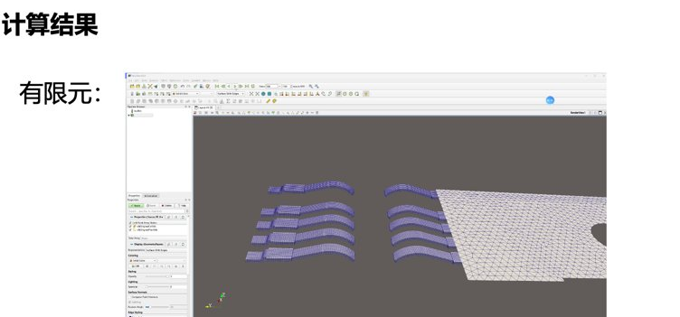

**新模态接触结果**

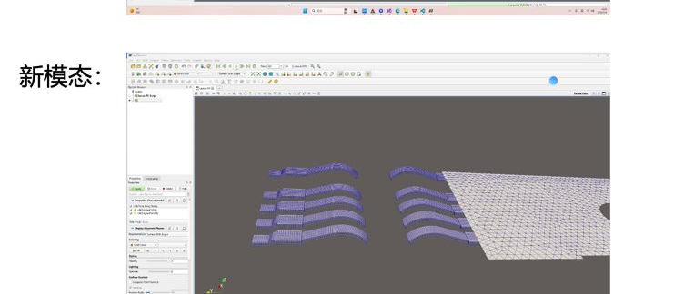

**有限元应力**

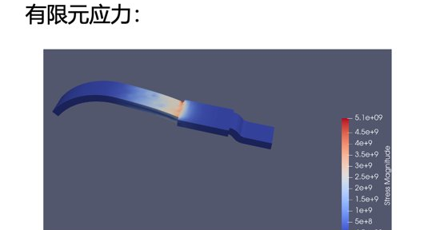

**新模态应力**

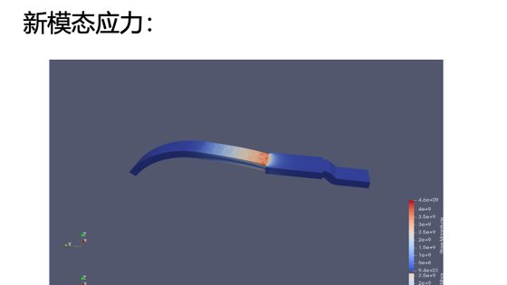

### 3 数据统计

|  | 生成模态数据 | 模型训练 | 仿真总耗时 | 神经网络查询耗时 |
|--|--|--|--|--|
| 新模态（神经网络） | 含应力数据 27.28s | 127.53s | 455.04s | — |
| 有限元 | — | — | 16017.63s（~4h） | — |

---

## 案例四：差速器接触案例

### 1 模型描述

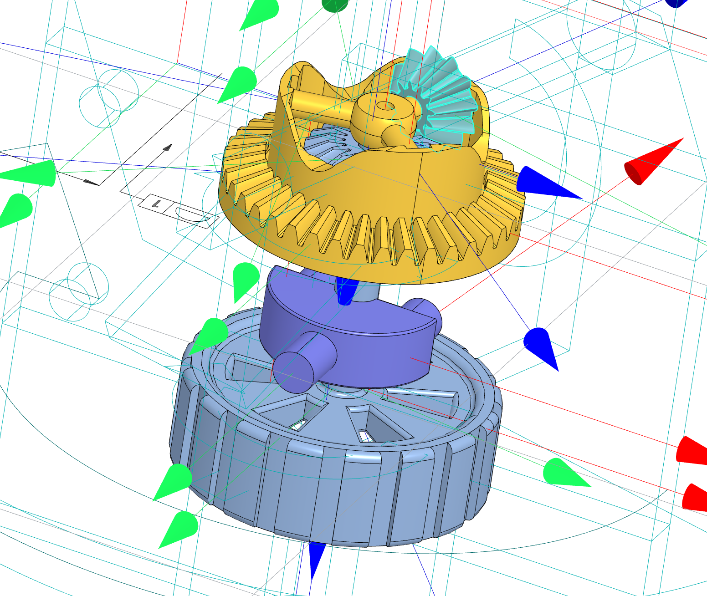

图为差速器，黄色齿轮为传动齿轮，浅蓝色为轮胎，轮胎沿着轮轴旋转，将蓝色小齿轮建立为新模态柔性体，同时在轮胎上施加顺时针旋转力进行接触仿真。

- **柔性体**：应力网格 130267，节点 26429

### 2 计算结果

**有限元接触界面网格**

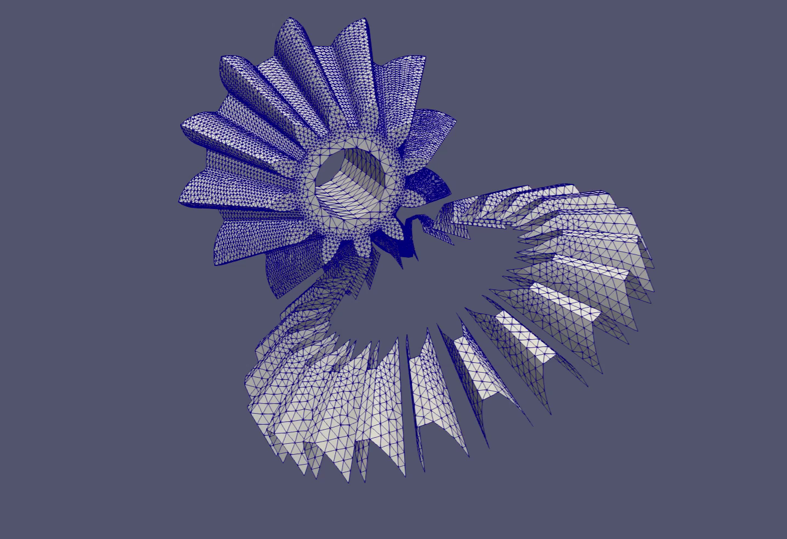

**新模态应力云图**

### 3 数据统计

|  | 生成模态数据 | 模型训练 | 仿真总耗时 | 神经网络查询耗时 |
|--|--|--|--|--|
| 新模态（+神经网络） | 9672s | 数据前处理：174.69s；训练：487.33s | 8862.582s | 148.15s |
| 新模态 | — | / | 6450s（读取 254s + 计算 6196s） | / |
| 有限元 | 16205.035s（4.5h） | — | — | — |
